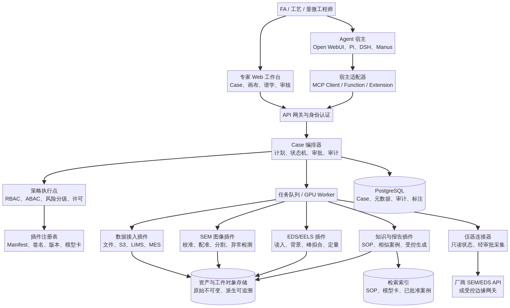
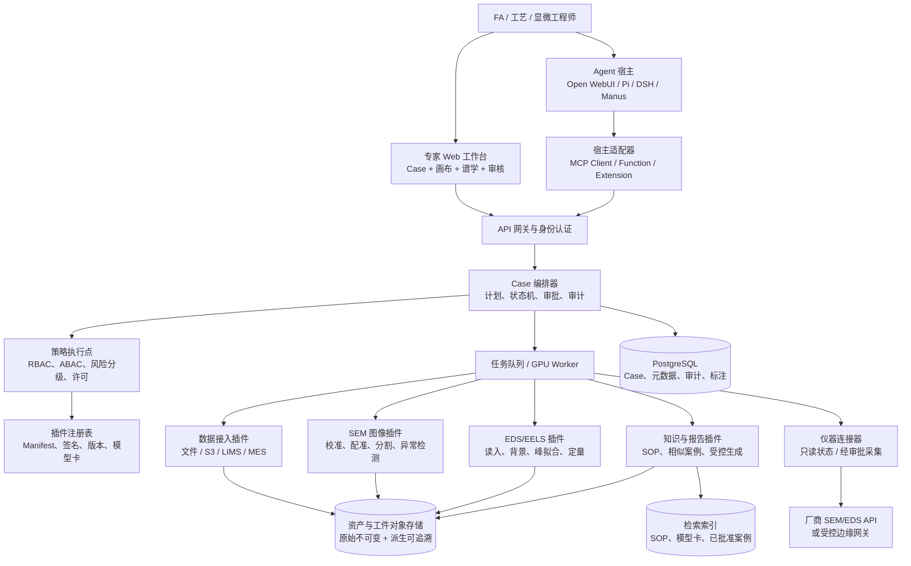

# SemiSpectra Agent：面向半导体检测的插件式 SEM AI 分析 Agent

**版本：** 0.1.0（方案基线）  
**作者：** Manus AI  
**日期：** 2026-08-27  
**项目代号：** `sem-spectrum-agent`

## 1. 摘要与决策建议

本项目建议定位为一个**可嵌入多种 Agent 宿主的 SEM 智能分析插件平台**，而非“在通用聊天框中上传一张 SEM 图片后生成描述”的单点应用。产品的主价值是把半导体失效分析（FA）、工艺监控、缺陷复核所需的图像、谱图、仪器元数据、历史样本、规则与人工判断组织成可追溯的分析链路，并把每一项确定性计算、模型推理和高风险仪器动作封装为权限可控的插件能力。

第一阶段应聚焦 **离线/准实时的 SEM 图像 + EDS 谱图/谱图映射复核**，将分析输出限定为“证据、候选假设、置信度、不确定性与建议的下一步测量”，而不是自动下结论或直接控制设备。跨宿主的核心边界应基于 MCP 工具与资源；领域插件需使用独立、版本化的 Manifest 描述输入、输出、权限、模型、许可证及校准要求。独立的 Python 执行容器承载谱学与视觉计算，Web 工作台承载复核、标注、报告与审计。这样既能适配 Open WebUI 的 Tools/Functions、Pi 的本地扩展、DSH 的 `dsh.bundle` 风格市场，也能作为单独的企业应用接入现有 MES/LIMS/FA 系统。[1] [2] [3] [4]

> **核心原则：** LLM 负责理解意图、规划可解释工作流、检索证据和生成受约束报告；数值拟合、峰识别、定量、缺陷定位和统计判定必须由可复现的确定性算法或版本锁定的视觉模型执行，并保留原始工件与参数。

| 决策项 | 建议 | 原因 |
|---|---|---|
| 首个可交付场景 | SEM 二次电子/背散射图像 + EDS 单谱与 Mapping 的缺陷复核 | 输入边界清晰，可直接形成“定位—元素证据—复核报告”的闭环。 |
| 产品形态 | 独立 Web 工作台 + MCP Server + 宿主适配器 | 不锁定任何单一聊天产品；既支持专家可视化复核，也支持 Agent 调用。 |
| 插件边界 | 计算/数据连接/策略/UI 四类插件 | 避免把仪器 API、算法、审批策略、页面逻辑耦合在一个扩展中。 |
| 视觉策略 | 异常检测优先，分类模型后置 | 真实缺陷类别稀少、标注昂贵且跨设备漂移显著；正常样本建模更适合 MVP。 |
| 谱学策略 | 校准参数驱动的传统谱学算法 + LLM 解释层 | EDS/EELS 的峰重叠、背景、吸收/荧光、几何效应不能由通用视觉模型替代。 |
| 控制边界 | V1 只读；V2 才增加经审批的采集建议；V3 才评估闭环控制 | 保护晶圆、设备与客户数据，便于通过工厂 EHS、IT 和质量流程。 |

## 2. 目标用户、问题和产品形态

产品面向三类高价值用户。**失效分析工程师**需要快速复核局部异常、把 SEM 对比图和 EDS 成分证据转成可交付的 FA 结论。**工艺/良率工程师**需要把跨批次、跨机台的异常模式关联到层别、配方、腔体和历史 SPC 记录。**显微镜/实验室工程师**则需要在不破坏既有控制面板的前提下，通过建议的 ROI、倍率、加速电压、驻留时间或 Mapping 路径提高采集效率。三者共同需要“可追溯、可复现、可人工推翻”的结论，而不是黑盒告警。

产品采用“**工作台优先，聊天为辅**”的形态。主界面是 Case（案件）工作区：左侧为数据与任务时间线；中央为支持金字塔、多尺度缩放、叠加蒙版、ROI 和对照图同步浏览的 SEM 画布；右侧是证据卡、成分/峰拟合、缺陷候选、Agent 对话和审批操作；底部为原始数据、参数、模型版本与审计时间线。聊天入口是创建工作流、解释结果、检索相似案例和生成报告的自然语言层，而不可替代画布、标注与审核。

| 页面/入口 | 核心对象 | 用户可完成的任务 | 不应由 LLM 单独决定的内容 |
|---|---|---|---|
| Case 工作台 | 样本、晶圆、die、层、ROI、数据采集 | 聚合一次 FA/复核的所有输入，分派审核和导出报告 | 样本身份、量产判定、放行状态。 |
| SEM 证据画布 | 原图、多尺度金字塔、分割蒙版、ROI、标尺 | 对齐前后/参考图，确认缺陷区域，人工纠正掩膜 | 像素校准、标尺和图像来源。 |
| 谱学面板 | 原谱、背景、峰拟合、元素表、谱图 Mapping | 验证候选元素、查看残差、比对参考谱 | 计数、能量标定、定量方法与探测器校准。 |
| Agent 面板 | 目标、计划、工具调用、证据、报告草稿 | 用自然语言发起可审计工作流并追问结论依据 | 高风险动作、最终处置和任何仪器写操作。 |
| 插件中心 | 清单、权限、版本、模型卡、批准状态 | 安装/升级已审核插件、配置连接器、查看审计 | 未签名代码执行、越权数据访问。 |

### 2.1 关键用户旅程

工程师建立 Case 后导入厂商导出的 SEM 图像、EDS `.msa/.emsa`、谱图 Mapping 或由受控连接器索引到对象存储。数据接收插件读取但不修改原件，生成带校验和的 `Asset`；预处理插件执行平场/漂移/标尺解析等非破坏性操作，并为每个派生物记录参数。异常检测插件在参考图、正常样本库或弱监督模型的支持下提出 ROI；用户确认后，EDS 分析插件在对应位置执行能量校准检查、背景拟合、候选峰与定量分析。Agent 只能从结构化结果中组织“证据—解释—限制—下一步”的报告，且每个自然语言结论均回链到 ROI、谱图区间、算法版本和输入哈希。

当证据不足时，Agent 生成的是**测量计划草案**，例如“在 ROI-03 周边新增三个对照点”、“以给定探测器校准检查 Si Kα/Al Kα 分离度”或“采集更高计数的 Mapping”。它不会直接运行采集。用户在工作台确认并由仪器连接器检查状态、配方、互锁与权限后，才会向厂商 API 或 RPA 网关提交请求；该动作在 V2 之前保持关闭。

## 3. 从参考产品提炼的架构与体验原则

Open WebUI 已明确将旧的 Pipelines 标为 legacy，并建议新场景采用 in-process Functions/Tools，或以 OpenAPI/MCP 对接外部服务。[1] 因此本项目不能把复杂的科学计算与厂商 SDK 塞进聊天应用的进程，而应将其作为边界清晰的外部能力。Pi 的扩展允许注册工具、订阅生命周期、拦截调用、保存会话以及提供交互组件，说明插件应同时有“工具面”和“用户/会话面”。[2] DSH 的核心与市场强调“万物插件”、描述式 `dsh.bundle` 清单和统一安装/升级，说明产品需原生具备能力发现、依赖解析、版本治理和审核状态，而非只管理 Python 包。[3]

MCP 定义了 Host—Client—Server 的 JSON-RPC 连接以及 Resources、Prompts、Tools 三类 Server 能力，适合做跨宿主的互操作面。[4] 但 MCP 本身不替代企业权限、数据主权与校准管理；它还特别提醒工具属于任意代码执行，Host 必须获得用户明确同意并让用户理解工具行为。[4] 因此产品安全设计应将工具按风险分级，且把“读数据、运行算法、生成报告、建议采集、执行采集”拆成不同授权路径。

| 参考产品/协议 | 借鉴点 | 本项目的具体落地 | 不直接照搬的部分 |
|---|---|---|---|
| Open WebUI | Tool/Function/MCP 作为新扩展路径 | 提供 Open WebUI Function：创建 Case、查询任务、展示报告链接；谱学计算走远端 MCP | 不使用 legacy Pipelines 承载关键科学计算。 |
| Pi Agent | 生命周期钩子、本地项目扩展、会话持久化 | 提供 `pi-sem-spectra` 适配器：注册 Case/分析/报告命令并把工件链接回 CLI 会话 | 不把 GUI 专家复核体验压缩为纯 TUI。 |
| DSH | Manifest、能力可替换、市场化分发 | `sem.plugin.yaml`、签名/批准状态、依赖和权限解析、私有插件目录 | 仪器插件不允许“市场一键安装后直接控制设备”。 |
| Manus 式工作流体验 | 任务分解、过程可见、工件交付、可追溯动作 | Case 中显示分析计划、运行进度、每步工件和最终报告 | 不将通用 Agent 自治性延伸为无审核的实验室控制。 |
| MCP | 跨宿主工具、资源、提示词协议 | 每个领域插件可选择暴露 MCP Tools/Resources；所有调用带 Case 和审计上下文 | 不以 MCP 取代数据层、模型注册表、审计和审批。 |

## 4. 总体技术架构

系统由六层组成。体验层包括专家 Web 工作台、Open WebUI/Pi/DSH/Manus 适配器和 API。编排层包括 Case 状态机、Agent 计划器、策略执行点与任务队列。插件层基于受签名的清单加载数据连接、科学计算、视觉推理、检索和报告模块。数据层管理不可变原始资产、派生工件、标注、向量索引、实验/模型元数据和审计记录。设备层以厂商适配器隔离 SEM/EDS SDK。基础设施层提供本地部署、GPU worker、对象存储、队列、关系型数据库和可观测性。



架构中关键的边界是：**LLM 不获得对象存储、数据库或仪器 SDK 的通配凭证**；它只能调用带有 JSON Schema 的、Case 绑定的工具。工具的服务器端在执行前验证用户、租户、Case ACL、数据区域、插件权限、风险级别、输入签名和调用策略。所有长任务返回 `analysis_run_id`，工件保存在租户隔离的对象路径，并以签名 URL 或工作台链接提供给用户。



### 4.1 建议的组件选型

| 层 | 推荐技术 | 选择依据 | V1 边界 |
|---|---|---|---|
| Web 工作台 | React/TypeScript、OpenSeadragon 或 napari Web 视图、Plotly | 支持超大图缩放、ROI 绘制、谱图/残差交互与组件化页面；napari 的 BSD-3-Clause 许可使其适合作为参考或桌面复核能力。[10] | 仅 Web，不做桌面版。 |
| 后端/API | Python FastAPI、Pydantic、OpenAPI | 科学计算生态与强 schema 验证，适合异步任务契约 | API 不直接暴露厂商 SDK。 |
| MCP 服务 | FastMCP 或官方 SDK、Streamable HTTP | 可快速暴露版本化 Tools/Resources；FastMCP 为 Apache-2.0 许可。[9] | 先提供只读分析工具。 |
| 科学计算 | NumPy/SciPy、scikit-image、pyFAI（如需）、自研 EDS 逻辑；隔离使用 HyperSpy/eXSpy | HyperSpy 生态已覆盖多维数据、EDS/EELS 和格式 I/O。[5] | GPL 组件进隔离可选容器，产品核心避免直接耦合。 |
| 视觉推理 | PyTorch、ONNX Runtime/TensorRT、Anomalib、SAM/专用分割模型 | Anomalib 为 Apache-2.0，适合工业异常检测的 PoC。[11] | 先用 anomaly map + 人审，不做缺陷放行。 |
| 大图存储 | S3 兼容对象存储、OME-Zarr/金字塔切片 | 适合原始资产不可变、派生物缓存、分块读取 | 支持 TIFF/PNG/JPG + JSON 元数据；厂商原始格式由插件扩展。 |
| 数据库/队列 | PostgreSQL、Redis + Celery/RQ 或 Temporal | Case 状态、审计与异步 GPU 作业的可靠运行 | 单租户可先使用最小部署。 |
| 可观测性 | OpenTelemetry、Prometheus、结构化审计事件 | 分析流程必须可诊断、可复算、可审计 | 每个 Run 必须记录版本与输入哈希。 |

### 4.2 Agent 工作流与工具集

V1 Agent 采用受限状态机，而非自由多代理循环。它可依次运行“资产检验—图像预处理—ROI 候选—谱图拟合—证据合成—人工复核—报告草稿”七步；每步的输入、输出、失败和可重试条件由 `WorkflowSpec` 固定。自然语言仅选择目标、范围与已批准的工作流模板，不能编写或执行任意 Python 代码。

| MCP Tool | 输入摘要 | 输出摘要 | 风险 | 备注 |
|---|---|---|---|---|
| `case.create` | 样本标识、目的、访问域 | `case_id` | 低 | 标识仅允许从受控字典选择或确认。 |
| `asset.ingest` | 文件引用、来源、校验策略 | `asset_id`、格式/标尺/元数据校验 | 中 | 原始件 WORM 保存，恶意文件扫描。 |
| `sem.prepare_image` | `asset_id`、预处理配置 | 派生图、质量指标、变换链 | 低 | 不覆盖原图。 |
| `sem.detect_anomalies` | 预处理图、参考策略、模型版本 | ROI、热力图、置信/不确定度 | 中 | 强制记录模型卡与阈值。 |
| `spectra.fit_eds` | 谱图、校准、候选元素、拟合策略 | 峰表、残差、定量、质量标志 | 中 | 不能跳过校准/质量检查。 |
| `evidence.compare_reference` | 当前工件、同层参考集 | 差异图、统计差异、相似案例 | 中 | 数据域与脱敏策略前置。 |
| `report.draft` | 已批准证据对象、模板、语气 | 有证据引用的报告草稿 | 低 | 禁止无证据的成分/根因断言。 |
| `instrument.propose_acquisition` | 缺口证据、模板、设备能力 | 待审采集计划 | 高 | V1 可见不可执行。 |
| `instrument.execute_acquisition` | 已批准计划、二次确认、设备状态 | 指令回执、采集资产 | 极高 | V1 禁用；V2 起双人复核与边缘网关控制。 |

## 5. 插件模型与开发者体验

插件是具有明确供应者、版本、依赖、权限、输入输出 schema、运行时和质量声明的包。一个插件可以同时暴露服务端 API、MCP Tools、前端面板和数据迁移，但每一项能力都必须在清单中显式声明。容器镜像、wheel 或 WASM 模块都可作为分发物；涉及 GPL、厂商 SDK 或 GPU 驱动的插件必须作为隔离部署单元运行。

插件分为四种类型。**数据连接插件**连接文件夹、S3、LIMS、MES 或厂商导出；**分析插件**执行图像/谱学计算；**策略插件**管理质量门、审批、保留期限和报告模板；**呈现插件**为工作台提供谱图、ROI 表格、模型卡等受限 UI 面板。仪器控制插件是独立的第五类高风险插件，不可与普通分析插件共用服务账户或网络策略。

```yaml
# sem.plugin.yaml（示例）
apiVersion: semispectra.io/v1alpha1
kind: SemPlugin
metadata:
  id: com.semispectra.eds-core
  name: EDS Core Analysis
  version: 0.1.0
  vendor: SemiSpectra Labs
  license: Apache-2.0
  maturity: experimental
spec:
  type: analysis
  runtime:
    kind: oci
    image: ghcr.io/acme/sem-eds-core:0.1.0
    entrypoint: sem_eds_core.server:mcp
  capabilities:
    mcp:
      tools:
        - spectra.validate_eds
        - spectra.fit_eds
        - spectra.quantify_eds
      resources:
        - semispectra://calibration/{instrument_id}
    ui:
      panels:
        - spectra-fit-inspector
  contracts:
    inputs:
      - application/vnd.emsa.msa
      - application/vnd.eds.spectrum+json
    outputs:
      - application/vnd.semispectra.peakfit+json
      - application/vnd.semispectra.quantification+json
  permissions:
    data:
      read: [case_asset, calibration]
      write: [derived_artifact, analysis_result]
    network:
      egress: none
    compute:
      gpu: false
  quality:
    requiresCalibration: true
    emitsUncertainty: true
    testDataset: semispectra://registry/fixtures/eds-core-v1
  provenance:
    sbom: sbom.spdx.json
    signature: cosign://sha256:REPLACE_AT_RELEASE
```

### 5.1 插件注册、审核与运行规则

插件中心必须有四个状态：`draft`、`verified`、`approved` 和 `revoked`。开发者可在本地或隔离环境发布 `draft`；CI 通过 schema、单元测试、确定性回归样本、SBOM 和漏洞扫描后成为 `verified`；质量/IT 管理员按部署域批准成为 `approved`；发现漏洞、结果偏移或厂商许可问题可随时撤销。生产 Case 只能运行 approved 版本，运行中使用的插件 digest、模型权重 hash、参数、校准 ID 和输入 hash 都须写入不可变 `ProvenanceRecord`。

插件依赖需采用“核心强约束、算法弱耦合”的方式。核心定义稳定的 `Asset`、`ROI`、`Spectrum`、`FitResult`、`Quantification`、`AnalysisRun` 和 `EvidenceClaim` 契约；插件只在契约层交互，禁止直接读写彼此私有数据库。每个插件提供最低限度的样例输入、预期输出、容差范围和失败模式。对大模型工具调用，要同时定义 JSON Schema 与人类可读的风险说明，防止含糊的工具描述诱导越权操作。

## 6. SEM 图像与智能谱学算法方案

### 6.1 图像链路

SEM 图像分析先处理“能不能比较”，再处理“哪里异常”。导入时解析像素大小、倍率、加速电压、工作距离、探测器、扫描方向和厂商元数据；若关键元数据缺失，则标记为不可用于绝对尺寸或跨机台对比。预处理阶段包含极性检查、漂移/扫描畸变评估、亮度归一化、去噪、金字塔切片与可选参考图配准。检测阶段将正常样本库或 golden image 用作基准，先通过多尺度差分、纹理特征、频域特征和自监督异常检测提出 ROI，再由分割/检测模型细化边界。

V1 的 KPI 不能只看“图像分类准确率”。应在 Case/ROI 粒度评估：候选缺陷的**召回率**、每平方毫米或每视场的**误报数量**、缺陷像素/实例的 IoU、不同设备/层别/批次间的性能下限、人工复核节省时间以及不确定性校准误差。对于量产检测，任意模型都必须在留出机台、留出批次和时间后验证，不能随机拆分同一晶圆的相邻视场。

### 6.2 EDS/谱学链路

谱学插件的输入是原始计数与能量轴、探测器/几何元数据、校准参考和用户定义的上下文，而不是图片截图。标准工作流包含能量轴校验、死时间和采集质量检查、连续背景估计、峰形拟合、峰重叠处理、元素候选筛选、ZAF/φ(ρz) 等适用定量模型、残差与不确定度输出。对每个元素结论，系统都需要同时显示：候选线系、能量窗、拟合面积、背景、残差、置信区间、潜在干扰、检测限和使用的标准/无标样方法。

HyperSpy/eXSpy 为多维信号、EDS/EELS 和格式读写提供了成熟科学软件生态，但核心仓库使用 GPL-3.0，因此商业产品应把它作为可替换的隔离分析后端，而不是静态链接到专有核心中。[5] AutoEMX 已展示从 SEM-EDS 采集、峰背景定量、规则过滤到机器学习相组成的端到端流程；然而它的公开许可证限定非商业使用，且其验证重心是粉末与一般材料表征，不能直接作为半导体量产产品组件。[6]

### 6.3 多模态证据合成与 LLM 约束

Agent 不能从原始图像“猜”元素或根因。它获得的是受控的结构化证据包：ROI 坐标、缺陷分数/模型版本、图像处理链、峰拟合结果、定量及不确定性、历史案例摘要、已批准 SOP 片段。报告生成器使用带引用的模板，并在句子级别产出 `EvidenceClaim[]`。任何“存在元素 X”“可能为残留物 Y”“建议追加测量 Z”都要求有与之绑定的谱图区间、拟合质量、规则或 SOP；没有证据时只能说“当前数据不足以判断”。

| 输出层级 | 可由 Agent 输出的内容 | 强制约束 |
|---|---|---|
| 观察 | ROI 的形貌差异、峰拟合曲线、异常分数 | 必须关联到工件、坐标、工具版本。 |
| 解释 | 与已批准案例/SOP 一致或矛盾的假设 | 使用“候选/支持/不支持”语言，标明假设前提。 |
| 建议 | 追加的对照点、谱图质量检查、复核路线 | 生成可审批计划；默认不执行。 |
| 决策 | 产品放行、报废、工艺调参、设备写操作 | Agent 仅提供证据包，不自动决定；必须纳入人和既有 QMS/MES 流程。 |

## 7. 数据、模型、验证与合规

核心数据对象以 Case 为边界。每个 `Case` 关联样本/晶圆、设备、工艺上下文、访问域与保留规则；`Asset` 表示原始数据并以 SHA-256 标识；`DerivedArtifact` 表示图像金字塔、掩膜、峰拟合、热力图或报告；`Annotation` 记录人审的 ROI、缺陷类别和可信度；`AnalysisRun` 记录工作流、插件和模型版本；`EvidenceClaim` 将报告语句与来源工件绑定。所有对象通过 UUID 与不可变的来源链相连。

模型注册表不仅保存权重，也要保存**模型卡、训练数据域、机台/探测器覆盖范围、预处理契约、已知失效模式、阈值、校准日期、评估切分策略、审批人和回滚版本**。模型升级采用 shadow mode：新版本与当前生产版本并行运行，不影响用户决策；性能满足预定义门限后，才进入受限试点并由质量负责人批准。人审结果要进入主动学习候选池，但训练数据必须经历去敏、标签复核、数据版本冻结与偏差评估。

半导体制造和客户样本通常具有高度敏感性。部署设计应支持厂内离线或私有网络部署、租户/工厂/项目级 RBAC + ABAC、对象存储加密、KMS 管理、最小化日志、数据区域限制和可配置保留/销毁策略。图像、谱图和工艺元数据不得被默认发送到外部大模型；如需使用外部模型，应通过脱敏、明确合同、地域控制、DLP 过滤和逐 Case 同意完成。设备控制要经过厂商接口审查、安全互锁与双人审批，且始终能由本地操作员中止。

## 8. 分阶段路线图、验收与风险

| 阶段 | 时间建议 | 范围 | 可演示成果 | 退出条件 |
|---|---:|---|---|---|
| 0. 架构验证 | 2–3 周 | Case、Asset、插件 Manifest、审计、样例数据 | 导入一张 SEM 图和一条 EDS 谱，生成可追溯的 Case | schema、审计、原始件不可变和权限测试通过。 |
| 1. MVP | 6–8 周 | 文件导入、图像画布、EDS 质量检查/峰拟合、异常候选、报告草稿、MCP 只读工具 | 专家 10 分钟内完成一次带图谱证据的复核 | 指定样例集上的回归测试、人工复核闭环和报告引用完整。 |
| 2. 试点 | 8–12 周 | 参考图/正常库、标注、相似案例检索、LIMS/MES 只读连接、模型注册表 | 跨两台 SEM/两类样本的 shadow run | 机台/批次留出验证，误报/召回达到与人工基线约定的目标。 |
| 3. 受控采集建议 | 6–10 周 | 仪器状态只读、采集计划草案、审批流、边缘网关 | 审批后的“建议—执行—归档”演示 | 安全互锁、回滚、审计、厂商 API 验收通过。 |
| 4. 闭环优化 | 按项目 | 受控仪器写操作、SPC/配方关联、主动学习 | 经质量体系批准的封闭试点 | 需独立 EHS/质量/IT/设备供应商审查。 |

主要风险不在于能否做出聊天界面，而在于数据域偏移、谱学错误解释、格式/厂商 API 碎片化、许可冲突和不可审计的模型输出。架构缓解策略是以资产/校准/模型/插件版本为第一等对象，以确定性工具代替自由文本推理，以 Case 审核代替自动处置，以兼容协议代替绑死一个宿主，并将 GPL/非商业许可组件以隔离服务和法律审查的方式处理。

## 9. 建议的仓库结构与首批插件

```text
sem-spectrum-agent/
├── docs/                         # 产品、架构、ADR、模型治理和安全文档
├── schemas/                      # JSON Schema：Asset、ROI、Spectrum、AnalysisRun、Plugin
├── plugins/
│   ├── sem-eds-core/             # EDS 校验、峰拟合、定量工具（示例）
│   ├── sem-image-anomaly/        # 图像预处理和异常候选（后续）
│   ├── sem-ingest-files/         # 本地/对象存储导入（后续）
│   └── host-adapters/            # Open WebUI、Pi、DSH、Manus 适配器（后续）
├── services/
│   ├── api/                      # Case/API 服务（后续）
│   ├── orchestrator/             # 工作流和策略执行点（后续）
│   └── mcp-gateway/              # 跨宿主 MCP 服务（后续）
├── examples/                     # 无敏感数据的合成/公开样例
├── tests/                        # 契约、回归、权限与端到端测试
└── .github/workflows/            # manifest/schema/安全检查 CI
```

首批要真正实现的插件是 `sem-ingest-files`、`sem-eds-core` 与 `sem-image-anomaly`。`sem-ingest-files` 负责格式识别、哈希与元数据抽取；`sem-eds-core` 先做 EDS 能量轴/采集质量检查并输出可审查的候选峰，不在没有校准信息时声称定量结果；`sem-image-anomaly` 采用参考图差分和异常热图生成 ROI，并要求人工确认。之后再做知识/报告插件，最后才考虑仪器连接器。

## 10. 现有 GitHub 项目调研结论

下表中的星标、最近更新与许可证为 2026-08-27 通过 GitHub API 检索的快照；它们用于衡量维护与生态信号，**不是**对科学正确性、商业可用性或安全性的担保。任何复用均须逐版本复核许可证、依赖树、数据处理条款和测试覆盖。

| 类别 | 项目 | 快照 | 可借鉴内容 | 采用建议 |
|---|---|---|---|---|
| Agent UI/宿主 | [Open WebUI][7] | 150,065 Stars；仓库标示 Other | 对话工作台、Tools/Functions/MCP 接入 | 做外部 MCP/Function 适配；不将科学计算嵌入旧 Pipeline。 |
| 轻量 Agent 扩展 | [Pi][8] | 98,008 Stars；MIT | TypeScript 扩展、钩子、工具与会话持久化 | 可提供 CLI 适配插件与本地开发体验。 |
| 全插件 Agent | [DeepSeek Harness][3] | 198,884 Stars；MIT | 一切皆插件、可替换核心、插件安装协议 | 借鉴 Manifest、市场和依赖治理，但不复制其运行时。 |
| 插件市场 | [dsh-market][12] | 2,553 Stars；MIT | 发现、搜索、一键安装/升级的交互 | 做私有、审批制企业插件中心。 |
| 标准协议 | [MCP Spec][4] | 9,065 Stars；仓库标示 Other | Tool/Resource/Prompt 与跨宿主边界 | 作为互操作面；叠加本项目权限、审计、审批。 |
| MCP 工程框架 | [FastMCP][9] | 27,402 Stars；Apache-2.0 | Python MCP Server 快速实现 | 可作为服务端基础库，仍需自有策略执行点。 |
| 多维显微分析 | [HyperSpy][5] | 580 Stars；GPL-3.0 | 多维数据模型、拟合、分解与生态 | 采用为隔离可选后端或作为算法参考。 |
| EDS/EELS | [eXSpy][13] | 14 Stars；GPL-3.0 | 领域谱学分析 API | 适用于研究验证；避免直接耦合专有分发核心。 |
| 科学格式 I/O | [RosettaSciIO][14] | 73 Stars；GPL-3.0 | 显微数据格式读取/写入 | 独立格式适配器，评估格式许可与厂商支持。 |
| 4D-STEM/衍射 | [pyxem][15] | 174 Stars；GPL-3.0 | 多维衍射数据分析 | 作为未来扩展，不放入 MVP 范围。 |
| 可视化/标注 | [napari][10] | 2,740 Stars；BSD-3-Clause | 多维科学图像浏览、插件生态 | 可借鉴交互和数据模型；Web 端另行实现。 |
| 工业异常检测 | [Anomalib][11] | 6,089 Stars；Apache-2.0 | 异常检测算法、训练与部署范式 | V1 `sem-image-anomaly` 的候选基线。 |
| 自动 SEM-EDS | [AutoEMX][6] | 10 Stars；非商业许可证 | 采集、量化、过滤、相组成自动化流程 | 仅作研究对照；商业化须重实现或取得授权。 |
| 半导体缺陷研究 | [VMamba for semiconductor][16] | 2 Stars；MIT | 面向晶圆缺陷检测的轻量模型复现 | 仅作实验基线；需自建 SEM 数据与跨设备验证。 |

## 11. 结论

SemiSpectra Agent 的差异化不应是“把 SEM 图片交给通用大模型”，而是建立一个能让大模型**安全、受控地组织科学工具**的插件平台。最佳产品形态是“专家工作台 + Case 证据图谱 + MCP 互操作层 + 审批制插件中心”。最佳工程切入点是将 EDS 质量/峰拟合和 SEM 异常候选做成可测试、带输出 schema 的插件，用样例和合作客户的脱敏数据建立版本化评估基线，再逐步扩展到知识检索、机台只读和受控采集。

这一路线把可行性风险前置到真正决定成败的问题：数据可用性、校准与量化、缺陷标签定义、跨设备泛化、人审效率、软件许可证、仪器安全和工厂数据主权。它也保留了对 Open WebUI、Pi、DSH 和 Manus 等不同 Agent 入口的兼容性，避免产品价值被某一个聊天宿主锁定。

## 参考资料

[1]: https://docs.openwebui.com/features/extensibility/pipelines/ "Open WebUI — Pipelines / Extensibility"
[2]: https://github.com/earendil-works/pi/blob/main/packages/coding-agent/docs/extensions.md "Pi — Extensions documentation"
[3]: https://github.com/deepseek-ai/deepseek-harness "DeepSeek Harness"
[4]: https://modelcontextprotocol.io/specification/2025-06-18 "Model Context Protocol — Specification"
[5]: https://hyperspy.org/ "HyperSpy — Multidimensional data analysis ecosystem"
[6]: https://github.com/CederGroupHub/AutoEMX "AutoEMX — Automated SEM-EDS workflow"
[7]: https://github.com/open-webui/open-webui "Open WebUI"
[8]: https://github.com/earendil-works/pi "Pi"
[9]: https://github.com/PrefectHQ/fastmcp "FastMCP"
[10]: https://github.com/napari/napari "napari"
[11]: https://github.com/open-edge-platform/anomalib "Anomalib"
[12]: https://github.com/dsh-market/dsh-market "dsh-market"
[13]: https://github.com/hyperspy/exspy "eXSpy"
[14]: https://github.com/hyperspy/rosettasciio "RosettaSciIO"
[15]: https://github.com/pyxem/pyxem "pyxem"
[16]: https://github.com/yijiazhang666/VMamba-for-semiconductor "VMamba for semiconductor"
